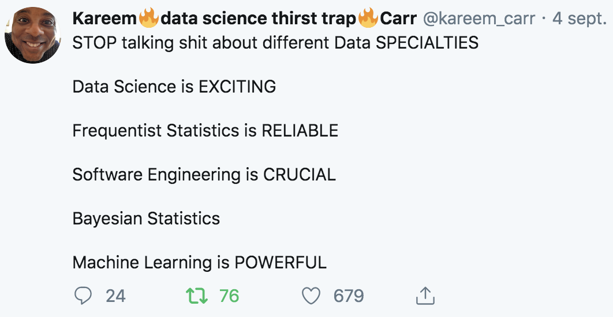

## Contents

- Problem description and approach

- Frequentist and bayesian methods

- tidyposterior examples

---

## Problem formulation

Given two models trained on the same dataset, we want to assess which one is better according to a given metric.

Requirements:

- We should not use test set to assess.

- We should embrace uncertainty.

Solution: 

- Metric in cross-validation folds ([trust your local cv](http://www.chioka.in/how-to-select-your-final-models-in-a-kaggle-competitio/)). 

- **Always use the same folds.**

???

- Model doesn't imply ml algorithm -> it can imply using different featrues, a more regularized version of the same model

---

## Example

Throughout the session we'll be using OK Cupid data.

```{r eval=TRUE, tidy=TRUE}
head(recipes::okc)
```

???

science, technology, engineering and mathematics

---

## Example (continuation)

Basic feature engineering (one hot encoding, date parsing).
Lasso, Xgboost and random forest trained.

```{r eval=TRUE, tidy=TRUE}
load(file = '../data/aucs.RData')

aucs
```

---

## Frequentist methods 1: paired t-test

- Doesn't account for correlation among folds (test considers independent samples).

```{r eval=TRUE, tidy=TRUE}
t.test(aucs$roc_auc_xgb, aucs$roc_auc_rf, paired = T)
```

---

## Frequentist methods 1: paired t-test (continuation)

```{r eval=TRUE, tidy=TRUE}
t.test(aucs$roc_auc_xgb, aucs$roc_auc_lasso, paired = T)
```
---


## Frequentist methods 2: Correlated t-test

Paired t-test that accounts for the correlation between samples (Nadeau and Bengio, 2003).

- There is no unbiased estimator for the correlation.

- Correlation parameter is estimated through an heuristic.

---

## Frequentist methods 3: ANOVA

$$auc = b_0 + b_1 m_1 + b_2 m_2$$

- Can compare multiple models.

- Uses models to compare models.

- Doesn't account for correlation.

- Doesn't answer *Which models are different?*

---

## Frequentist methods 3: ANOVA (continuation)

```{r eval=TRUE, tidy=TRUE, include = FALSE }
library(dplyr)
library(tidyr)
library(ggplot2)
theme_set(theme_minimal())
```

```{r eval=TRUE, tidy=TRUE}

# Convert dataframe from wide to long
anova_df <- aucs %>% 
  gather(model, value, -id)


# Anova finds differences
anova(lm(value ~ model, anova_df))
```

---

## Correlated structure!

- Folds 1 and 2 are easy.
- Folds 8 and 9 are hard.

```{r eval=TRUE, tidy=TRUE, echo=FALSE, fig.height=6 }
anova_df %>% 
  ggplot(aes(x = model, 
             y = value, 
             group = id, 
             color = id)) + 
  geom_line()
```

---

## Solution: random intercepts

Linear model

$$y_i=b_0+b_1x_i+e_i$$

Random intercepts model

$$y_{ij}=b_0+b_1x_{ij}+u_j+e_i$$


Not same as dummy variables, $u$ is a random variable.

???

Random intercepts -> cole, notes i examen nacional

---

## Bayesian methods 

Methods:

- Correlated t-test (Benavoli et al., 2017): _the probability of the bayesian t-test and p-value of the frequentist t-test are numerically equivalent_.

- ANOVA with random intercepts: [tidyposterior](https://tidymodels.github.io/tidyposterior/index.html) and [Max Kuhn talk](https://www.youtube.com/watch?v=MJdsnJCWIuA&t=853s).

---
class: center, middle

# Disclaimer: I'm not a bayesian activist.

---

## Bayesian/frequentist differences

- Frequentist methods: We assume both methods are equal have the same AUC and compute
$$P(x | AUC_1 = AUC_2) $$

- Bayesian methods: the parameter has a distribution of possible values. We have prior knowledge, and update the distribution according to the data. In our case,
$$P(AUC_1 - AUC_2 | x) $$
This is what we want to estimate!

---

## Frequentist pitfalls (Benavoli et al, 2017)


p-value depends on sample size


---

## Frequentist pitfalls (Benavoli et al, 2017)


p-value ignores magnitude


---

## Region of practical equivalence

ROPE: range of values of the metrics’ difference where we think the models as equivalent (definition left to the modeller). Three probabilities:
- $P(AUC_1 \gg AUC_2)$

- $P(AUC_1 \approx AUC_2)$ 

- $P(AUC_1 \ll AUC_2)$


  


---

## Bayesian comparison

```{r eval=FALSE, message=FALSE, warning=FALSE}

library(tidyposterior)

# Model and generate posteriors
bayesian_lm <- perf_mod(aucs, transform = logit_trans)

# Compare posteriors
bayesian_comparison <- contrast_models(bayesian_lm)

```

```{r eval=TRUE, include = FALSE }

library(tidyposterior)

# Model and generate posteriors
bayesian_lm <- perf_mod(aucs, transform = logit_trans)

# Compare posteriors
bayesian_comparison <- contrast_models(bayesian_lm)

```


---

## Plot differences

.pull-left[
```{r plot-label-2, eval=FALSE}
ggplot(tidy(bayesian_lm))
```
]

.pull-right[
```{r plot-label-2-out, ref.label="plot-label-2", echo=FALSE}
```
]

---

```{r}

# ROPE = 1%
summary(bayesian_comparison, size = 0.01) %>% 
  select(contrast, pract_neg, pract_equiv, pract_pos)

# ROPE = 3%
summary(bayesian_comparison, size = 0.03) %>% 
  select(contrast, pract_neg, pract_equiv, pract_pos)

```
---

```{r}
# ROPE = 1%
ggplot(bayesian_comparison, size = 0.01)
```

---

```{r}
# ROPE = 3%
ggplot(bayesian_comparison, size = 0.03)
```

---

## Bayesian pitfalls

- Choosing priors.

- Defining ROPE.

- End up thinking black and white-ish.

---

## Conclusions

$$ $$

- Use cross-validation to compare models.

$$ $$
- Think about practical differences.

---


## Thanks and questions




---


## References 

- Inference for the Generalization Error (Nadeau and Bengio, 2003).

- Time for a Change: a Tutorial for Comparing Multiple Classifiers Through Bayesian Analysis (Benavoli et al, 2017).

- Comparing posteriors: Estimating Practical Differences Between Models (Max Kuhn, 2018 New York R Conference).

- tidyposterior package.


---