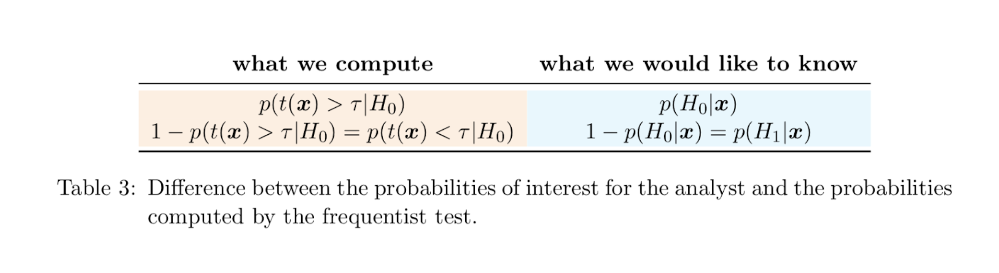
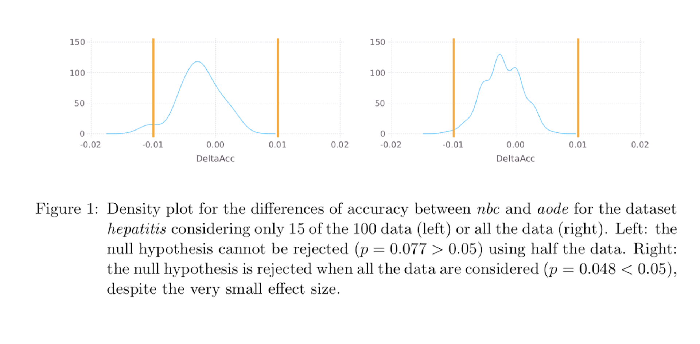
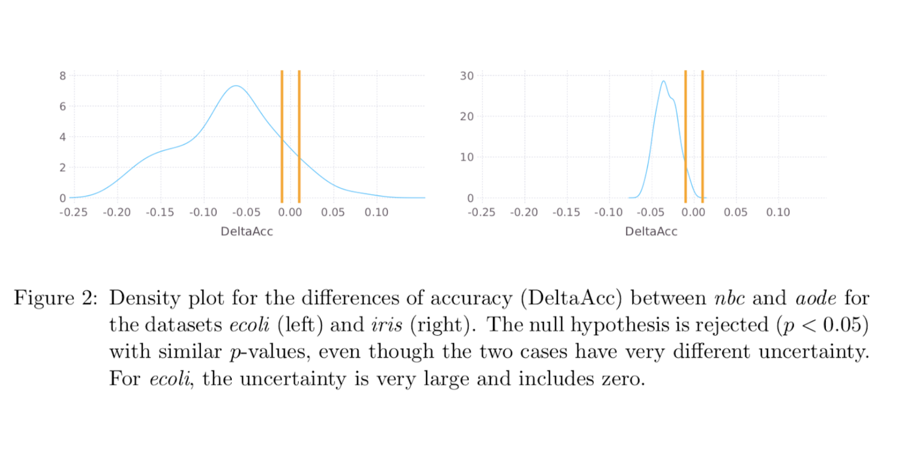
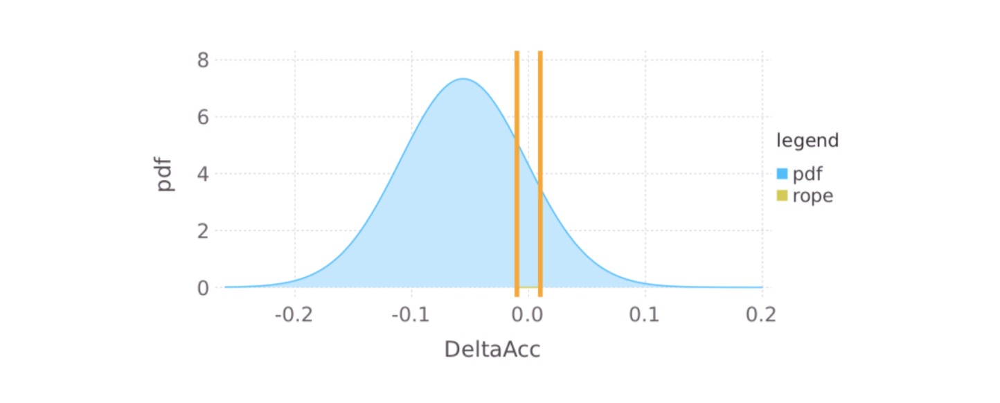

## Problem formulation

Given two models trained on the same dataset, we want to assess which one is better according to a given metric.

Requirements:
* We should not use test set to assess.
* We should embrace uncertainty.

Solution: metric in cross-validation folds ([trust your local cv](http://www.chioka.in/how-to-select-your-final-models-in-a-kaggle-competitio/)).

???

- Model doesn't imply ml model -> it can imply using different featrues, a more regularized version of the same model

---

## Example

Throughout the session we'll be using OK Cupid data.

```{r eval=TRUE, tidy=TRUE}
head(recipes::okc)
```

---

## Example (continuation)

Basic feature engineering (one hot encoding, date parsing).
Lasso, Xgboost and random forest trained.

```{r eval=TRUE, tidy=TRUE}
load(file = '../data/aucs.RData')

aucs
```


---

## Frequentist methods 1: paired t-test

- Doesn't account for correlation among folds (test considers sample independent).

```{r eval=TRUE, tidy=TRUE}
t.test(aucs$roc_auc_xgb, aucs$roc_auc_rf, paired = T)
```

---

## Frequentist methods 1: paired t-test (continuation)

```{r eval=TRUE, tidy=TRUE}
t.test(aucs$roc_auc_xgb, aucs$roc_auc_lasso, paired = T)
```
---


## Frequentist methods 2: Correlated t-test

Paired t-test that accounts for the correlation between samples (Nadeau and Bengio, 2003).

- Correlation parameter is estimated through an heuristic.

---

## Frequentist methods 3: ANOVA

$$auc = b_0 + b_1 m_1 + b_2 m_2$$

- Can compare multiple models.
- Doesn't account for correlation.

---

## Frequentist methods 3: ANOVA (continuation)

```{r eval=TRUE, tidy=TRUE, include = FALSE }
library(dplyr)
library(tidyr)
library(ggplot2)
```

```{r eval=TRUE, tidy=TRUE}

anova_df <- aucs %>% 
  gather(model, value, -id)


# Anova finds differences
anova(lm(value ~ model, anova_df))
```

---

## Correlated structure!

- Fold 1 and 2 are "easy".
- Fold 8 and 9 are "hard".

.pull-left[
```{r plot-label, eval=FALSE}
anova_df %>% 
  ggplot(aes(x = model, 
             y = value, 
             group = id, 
             color = id)) + 
  geom_line() + 
  theme_minimal()
```
]

.pull-right[
```{r plot-label-out, ref.label="plot-label", echo=FALSE}
```
]

---

## Solution: random intercepts

Linear model

$$ y_i = b_0 + b_1x_i + e_i $$

Random intercepts model

$$y_{ij}=b_0+b_1x_{ij}+u_j+e_i$$


Not same as dummy variables, $u$ is a random variable.


---

## Frequentist pitfalls (Benavoli et al, 2017)


p-value is not what we want to estimate



---

## Frequentist pitfalls (Benavoli et al, 2017)


p-value depends on sample size



---

## Frequentist pitfalls (Benavoli et al, 2017)


p-value ignores magnitude



---

## Bayesian methods 

Methods:
- Correlated t-test (Benavoli et al., 2017): (when number of samples grow, it tends to the frequentist t-test).
- ANOVA with random intercepts: [tidyposterior](https://tidymodels.github.io/tidyposterior/index.html) and [Max Kuhn talk](https://www.youtube.com/watch?v=MJdsnJCWIuA&t=853s).
Output: we obtain posterior distributions of the metric, and posterior distributions of the metric differences.


---

## Practical differences

- Region of practical equivalence (ROPE): range of values of the metrics’ difference where we think the models as equivalent (definition left to the modeller).
- Classification: classifiers whose difference in metric (auc, accuracy, f1) is less than 1% are usually thought as equivalent. The ROPE is then [-0.01, 0.01].


---

## Practical differences regions


Three probabilities:
- $P(m1 >> m2)$
- $P(m1 = m2)$ (practically)
- $P(m1 << m2)$


  


---

## Bayesian pitfalls

- Choosing priors
- Defining ROPE
- End up thinking black and white-ish.


---

## Bayesian comparison

```{r eval=FALSE, message=FALSE, warning=FALSE}

library(tidyposterior)

bayesian_lm <- perf_mod(aucs, transform = logit_trans)

bayesian_comparison <- contrast_models(bayesian_lm)

```

```{r eval=TRUE, include = FALSE }
library(tidyposterior)

bayesian_lm <- perf_mod(aucs, transform = logit_trans)

bayesian_comparison <- contrast_models(bayesian_lm)

```


---

## Plot differences

.pull-left[
```{r plot-label-2, eval=FALSE}
ggplot(tidy(bayesian_lm)) + 
  theme_minimal()
```
]

.pull-right[
```{r plot-label-2-out, ref.label="plot-label-2", echo=FALSE}
```
]

---

```{r}

summary(bayesian_comparison, size = 0.01) %>% 
  select(contrast, pract_neg, pract_equiv, pract_pos)
summary(bayesian_comparison, size = 0.03) %>% 
  select(contrast, pract_neg, pract_equiv, pract_pos)

```
---

```{r}
ggplot(bayesian_comparison, size = 0.01) + theme_minimal()

```


---
